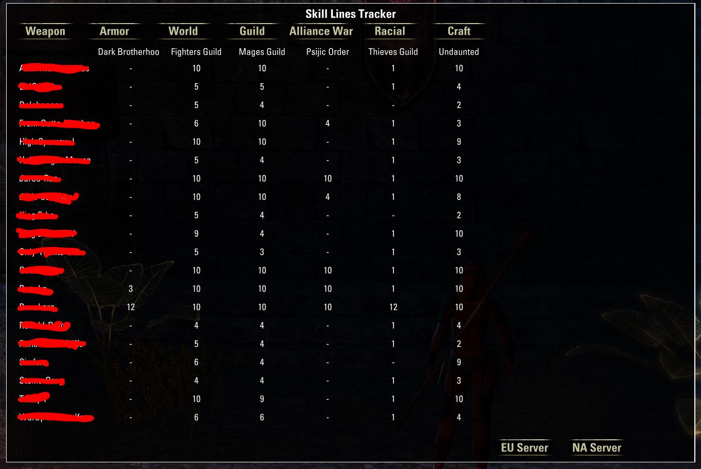

# Skill Lines

### View all your characters skill lines levels in one place.
    * For this Addon to work follow these steps:
        ** Install SkillLines into you ESO Addons file
        ** Launch the Game & Log into your first character
        ** Each character must be logged into to receive the data & load it into your saved variables file
        ** Once complete log into your first character again & open the Skills Menu (K by default on M&KB)
        ** Your Character Skill Lines Table is now showing.

Version 2 now Tracks all Skill lines with the exception of the Class skill lines.
Users can also now Track Character on the opposite server.

#
> This Add-on is not created by, affiliated with or sponsored by ZeniMax Media Inc. or its affiliates.
> The Elder Scrolls® and related logos are registered trademarks or trademarks of ZeniMax Media Inc. in the United States and/or other countries.
> All rights reserved.

> You can read the full terms at https://account.elderscrollsonline.com/add-on-terms

> Report & Submit your bugs and feature requests [Here](https://illyriat.com)